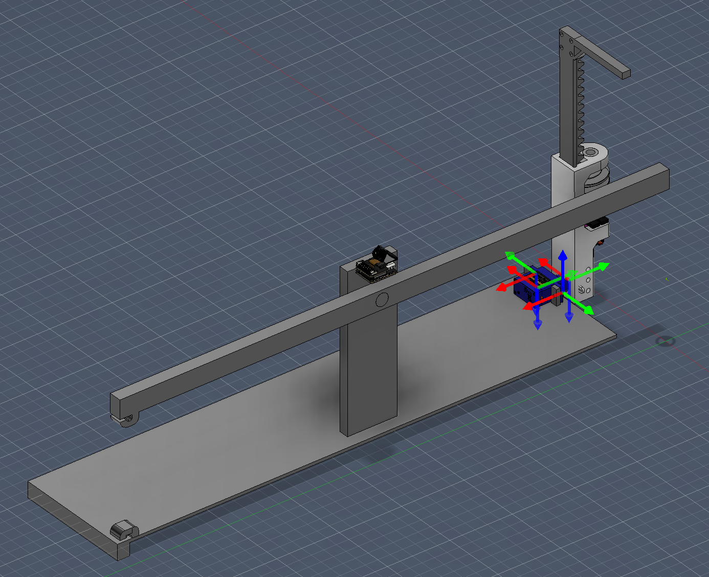
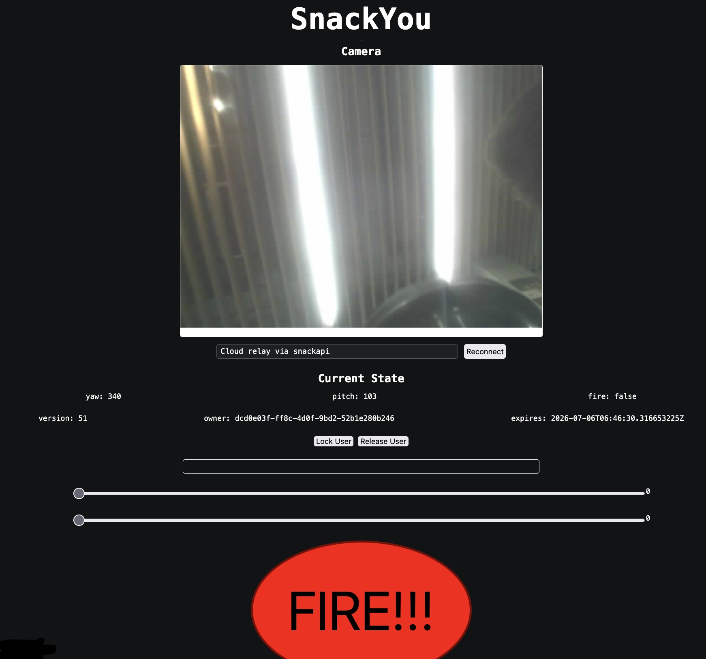

# Sn\*ck You!

A cool snack launcher.

[Try it out!](https://snackyou.zeusyboy.com/App)

## What is it
It's a snack launcher. You can use a web interface to control it, and also fight for control over it, so that you may fire snacks as projectiles at your friends. Fun!!! It uses a catapult mechanism for the firing.

## Why
Have you ever really wanted a snack but couldn't be bothered to get one yourself? Are your legs painted on? Well look no further than SnackYou. Simply order a snack delivery, and get pelted in the face by it! Maybe it'll also encourage you to order less snacks. Or more, if you're into that ;).

## Cool Images

## Install
### Prerequisites

- Nix with flakes enabled
- USB cable to connect to the XIAO ESP32-S3 Sense to flash firmware

### Web app

It's a static site found in /App and at [https://snackyou.zeusyboy.com](https://snackyou.zeusyboy.com)

#### Run locally
Open the html file in a browser or use a web server to host it.

The app uses the production website, if you want to use a local api, change the BASE_URL in App/api.js

The camera feed automatically connects to the esp32's upload to the api.

### API

The api code is found in /api. It's pretty much a state machine. The (AI Slop) documentation for this api is at /api/docs.md

#### Run locally

To run locally, simply run /api/debugapi.sh

This automatically uses air to hot reload.

The default port is :8080

#### Deploy with Docker

docker build -f DOCKERFILE -t snackapi  
docker run --rm -p 8080:8080 snackapi

### Firmware

ESP-IDF project for the Seeed Studio XIAO ESP32-S3 Sense with OV2640 camera module.

#### Configure

Change settings in /firmware before building by running idf.py menuconfig

In here you will find:
<ul>
<li> Wifi details
<li> Camera api on/off
<li> Camera upload url
</ul>

#### Build

In Nix, in /firmware, run idf.py build

#### Flash

Connect the S3 with USB, then in /firmware run idf.py -p /dev/ttyACM0 flash monitor

Make sure to replace /dev/ttyACM0 with the actual serial port for your device.

The ip can be found in the serial log. The camera frames can be found at http://[device-ip]/stream